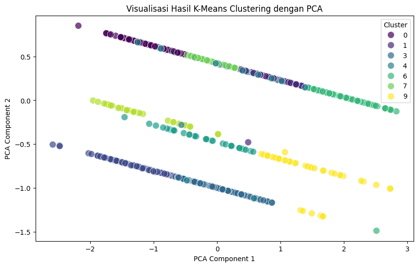
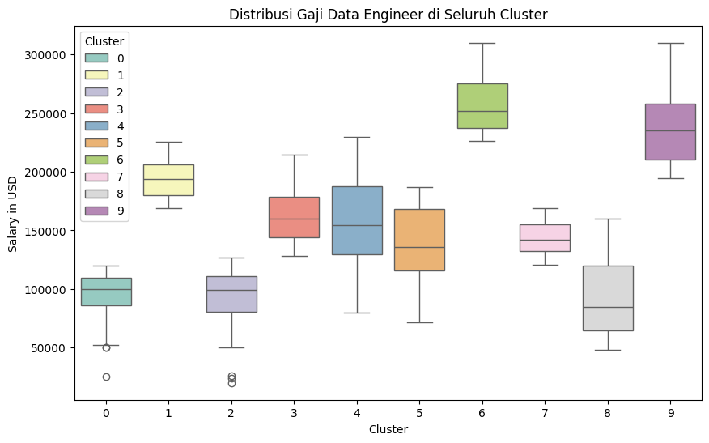

# 💼 Segmentasi Gaji Data Engineer di Amerika Serikat
Proyek ini bertujuan untuk melakukan segmentasi terhadap gaji Data Engineer di Amerika Serikat menggunakan teknik klasterisasi K-Means yang dioptimasi dengan Optuna. Hasil segmentasi divisualisasikan menggunakan PCA agar dapat dianalisis lebih lanjut.

---

## 🎯 Tujuan Proyek
Mengelompokkan Data Engineer berdasarkan tingkat pengalaman, tipe pekerjaan, ukuran perusahaan, dan gaji tahunan untuk menemukan pola tersembunyi yang dapat digunakan dalam pengambilan keputusan, baik untuk HR maupun pengembangan karier.

---

## 📁 Struktur Folder

```
📦 Data-Science-Final-Project-US-Data-Engineer-Salary-Segmentation
├── 📄 Data Science-Final Project-US Data Engineer Salary Segmentation.ipynb
├── 📄 data_engineer_salaries.csv
├── cluster_counts.png
├── pca_clusters.png
└── salary_boxplot.png
```

---

## 📊 Deskripsi Dataset
- **Sumber**: `data_science_salaries.csv`
- **Jumlah data awal**: 6.599 baris
- **Disaring**: hanya mengambil Data Engineer di **United States** → 1.066 baris
- **Setelah pembersihan outlier** → 1.054 baris

**Kolom yang digunakan:**
- `experience_level` (kategori)
- `employment_type` (kategori)
- `company_size` (kategori)
- `salary_in_usd` (numerik)
- `work_year` & `work_models` → informasi tambahan

---

## 🛠️ Teknologi dan Library
- **Python**: Pandas, NumPy
- **Scikit-learn**: KMeans, Pipeline, StandardScaler, OneHotEncoder, PCA
- **Optuna**: Optimasi jumlah cluster
- **Matplotlib & Seaborn**: Visualisasi
- **Google Colab**: Pengembangan dan eksekusi

---

## 🔎 Tahapan Analisis
1. **Preprocessing**:
   - One-hot encoding untuk data kategori
   - Standardisasi pada data numerik
2. **Clustering Awal**:
   - KMeans dengan 2 klaster → Silhouette Score awal: `0.3896`
3. **Optimasi Cluster dengan Optuna**:
   - Dicoba berbagai jumlah klaster dari 2 hingga 10
   - Hasil terbaik saat `n_clusters = 10` → Skor Silhouette: `0.5118`
4. **Visualisasi PCA**:
   - Reduksi dimensi data ke 2D untuk memvisualisasikan hasil klaster

---

## 📈 Visualisasi
### Visualisasi PCA
 <!-- Ganti path jika kamu mengunggah gambarnya -->

### Distribusi Jumlah Anggota per Cluster


### Perbandingan Gaji per Cluster


---

## 🔍 Temuan Penting
### 📌 Cluster 7 – Kelompok Terbesar
- Jumlah anggota: **228 orang**
- Rata-rata gaji: **$143.791**
- Semua bekerja secara **Full-time**, **Senior-level**, dan di **perusahaan ukuran sedang**

### 💰 Cluster 6 – Gaji Tertinggi
- Jumlah anggota: **95 orang**
- Rata-rata gaji: **$257.344**
- Didominasi oleh **Senior-level Full-time** di **perusahaan ukuran sedang**

---

## 🚀 Cara Menjalankan
1. Unggah file `data_science_salaries.csv` ke Google Colab.
2. Jalankan seluruh sel dalam notebook.
3. Seluruh proses akan dijalankan langsung di Colab.

---

## 📧 Kontak
Email: cindyzakya@gmail.com
